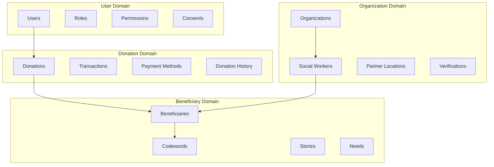
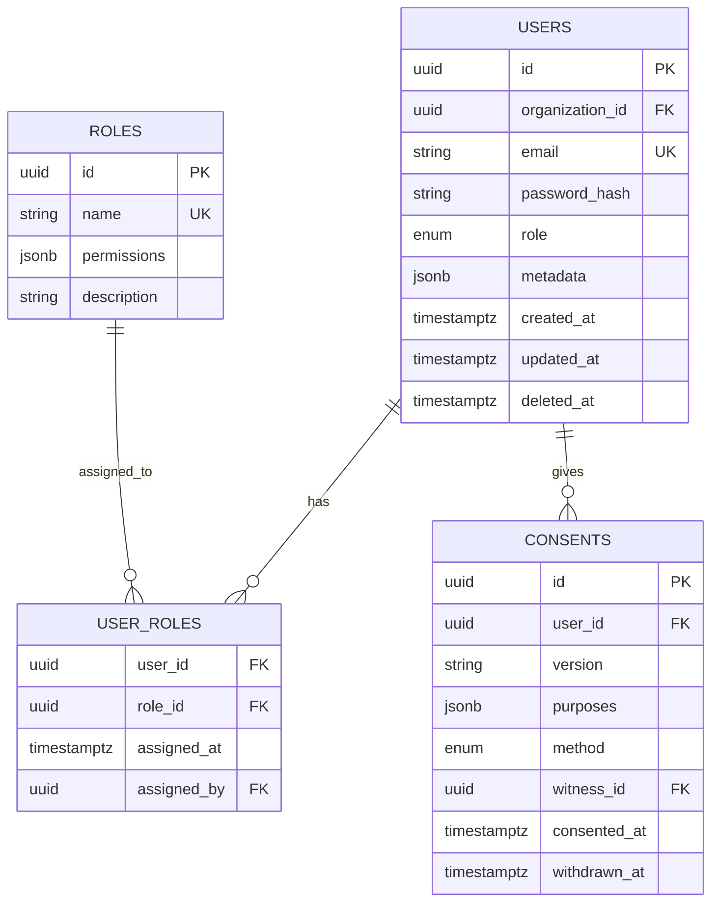
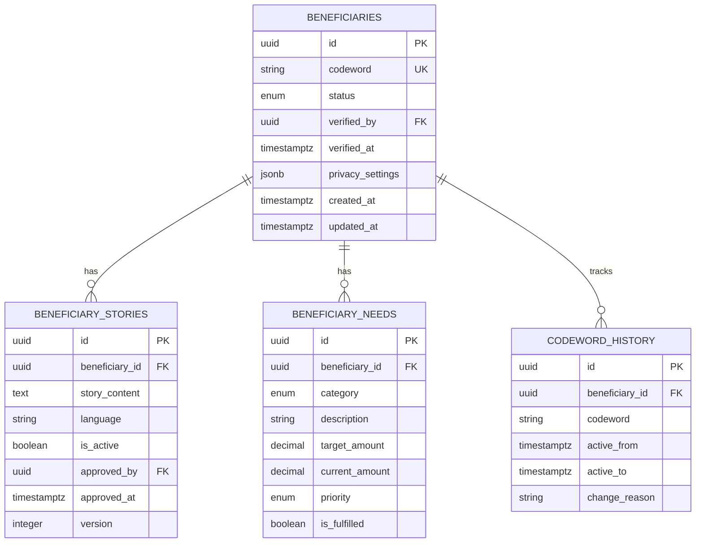
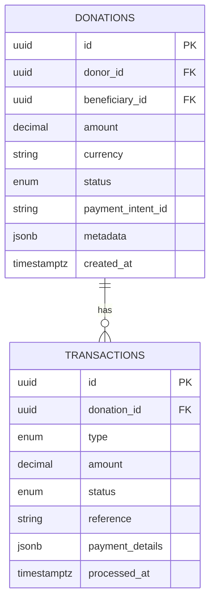
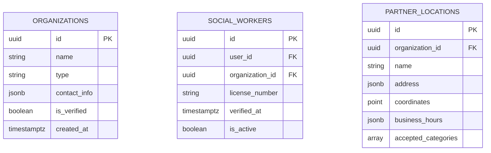

# CodeHeart Database Architecture

## 🏗️ Domain-Driven Database Design

This document outlines the database architecture for CodeHeart, following domain-driven design principles with a focus on security, scalability, and GDPR compliance.

## Overview



## Core Domain Entities

### 1. User Domain



### 2. Beneficiary Domain



### 3. Donation Domain



### 4. Organization Domain



## Security Implementation

### Row Level Security (RLS) Policies

```sql
-- Enable RLS on all tables
ALTER TABLE users ENABLE ROW LEVEL SECURITY;
ALTER TABLE beneficiaries ENABLE ROW LEVEL SECURITY;
ALTER TABLE donations ENABLE ROW LEVEL SECURITY;

-- Donor can only see their own donations
CREATE POLICY donor_donations ON donations
  FOR SELECT TO authenticated
  USING (donor_id = auth.uid());

-- Social workers can see assigned beneficiaries
CREATE POLICY social_worker_beneficiaries ON beneficiaries
  FOR ALL TO authenticated
  USING (
    EXISTS (
      SELECT 1 FROM social_workers sw
      WHERE sw.user_id = auth.uid()
      AND sw.id = beneficiaries.verified_by
    )
  );

-- Beneficiaries can only see their own data
CREATE POLICY beneficiary_self_access ON beneficiaries
  FOR SELECT TO authenticated
  USING (
    id IN (
      SELECT beneficiary_id FROM user_beneficiaries
      WHERE user_id = auth.uid()
    )
  );
```

### Audit Logging

```sql
-- Comprehensive audit table
CREATE TABLE audit_logs (
  id UUID DEFAULT gen_random_uuid() PRIMARY KEY,
  table_name TEXT NOT NULL,
  record_id UUID NOT NULL,
  action TEXT NOT NULL,
  actor_id UUID REFERENCES users(id),
  actor_ip INET,
  changes JSONB,
  created_at TIMESTAMPTZ DEFAULT NOW(),
  -- Partitioned by month for performance
  PRIMARY KEY (id, created_at)
) PARTITION BY RANGE (created_at);

-- Automated audit trigger
CREATE OR REPLACE FUNCTION audit_trigger()
RETURNS TRIGGER AS $$
BEGIN
  INSERT INTO audit_logs (
    table_name, record_id, action,
    actor_id, changes
  ) VALUES (
    TG_TABLE_NAME,
    COALESCE(NEW.id, OLD.id),
    TG_OP,
    current_setting('app.current_user_id', true)::uuid,
    jsonb_build_object(
      'old', to_jsonb(OLD),
      'new', to_jsonb(NEW)
    )
  );
  RETURN NEW;
END;
$$ LANGUAGE plpgsql;
```

## GDPR Compliance Features

### Data Anonymization

```sql
-- Anonymize user data for GDPR compliance
CREATE OR REPLACE FUNCTION anonymize_user(user_id UUID)
RETURNS VOID AS $$
BEGIN
  UPDATE users SET
    email = 'deleted-' || gen_random_uuid() || '@anonymous.local',
    metadata = jsonb_build_object('anonymized_at', NOW()),
    deleted_at = NOW()
  WHERE id = user_id;

  -- Keep donation records but anonymize
  UPDATE donations SET
    metadata = metadata || jsonb_build_object(
      'donor_anonymized', true,
      'anonymized_at', NOW()
    )
  WHERE donor_id = user_id;
END;
$$ LANGUAGE plpgsql;
```

### Data Retention Policies

```sql
-- Automated data retention
CREATE OR REPLACE FUNCTION cleanup_old_data()
RETURNS VOID AS $$
BEGIN
  -- Delete audit logs older than 1 year
  DELETE FROM audit_logs
  WHERE created_at < NOW() - INTERVAL '1 year';

  -- Anonymize inactive beneficiaries
  UPDATE beneficiaries SET
    codeword = 'INACTIVE-' || id,
    status = 'anonymized'
  WHERE updated_at < NOW() - INTERVAL '2 years'
  AND status = 'inactive';
END;
$$ LANGUAGE plpgsql;
```

## Performance Optimization

### Strategic Indexes

```sql
-- Frequently queried columns
CREATE INDEX idx_donations_donor_id ON donations(donor_id);
CREATE INDEX idx_donations_beneficiary_id ON donations(beneficiary_id);
CREATE INDEX idx_donations_created_at ON donations(created_at);
CREATE INDEX idx_beneficiaries_codeword ON beneficiaries(codeword);
CREATE INDEX idx_transactions_status ON transactions(status);

-- Composite indexes for common queries
CREATE INDEX idx_donations_donor_status ON donations(donor_id, status);
CREATE INDEX idx_beneficiaries_location ON beneficiaries USING GIST(location);

-- Full-text search on stories
CREATE INDEX idx_stories_search ON beneficiary_stories
  USING GIN(to_tsvector('german', story_content));
```

### Database Configuration

```yaml
# Supabase optimal settings
max_connections: 100
shared_buffers: 256MB
effective_cache_size: 1GB
work_mem: 4MB
maintenance_work_mem: 64MB

# Connection pooling
pool_mode: transaction
default_pool_size: 25
max_client_conn: 100
```

## Migration Strategy

1. **Version Control**: All migrations in `supabase/migrations/`
2. **Rollback Plan**: Each migration includes down script
3. **Testing**: Apply to staging before production
4. **Monitoring**: Track migration performance

---

**Document Version**: 1.0  
**Last Updated**: May 2025
