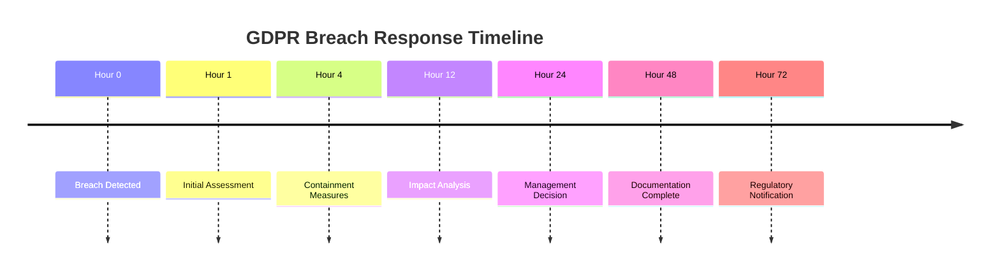

# CodeHeart GDPR/DSGVO Compliance Guide

## 🔒 Data Protection Compliance for Vulnerable Populations

This document outlines our comprehensive approach to German and EU data protection laws, with special considerations for protecting vulnerable individuals.

## 1. Legal Framework

### Primary Regulations

- **DSGVO** (Datenschutz-Grundverordnung) - German GDPR implementation
- **BDSG** (Bundesdatenschutzgesetz) - Federal Data Protection Act
- **TMG** (Telemediengesetz) - Telemedia Act
- **TTDSG** (Telekommunikation-Telemedien-Datenschutz-Gesetz)

### Special Considerations for Vulnerable Groups

According to GDPR Article 9 and German social law (SGB), homeless individuals require enhanced protection:

- Explicit consent mechanisms
- Simplified language options
- Audio/visual consent alternatives
- Social worker assistance for consent

## 2. Data Categories & Legal Basis

### Stakeholder Data Processing

| Stakeholder        | Data Categories           | Legal Basis                        | Retention            |
| ------------------ | ------------------------- | ---------------------------------- | -------------------- |
| **Donors**         | Name, Email, Payment info | Contract (Art. 6(1)(b))            | 10 years (tax law)   |
| **Beneficiaries**  | Codeword, Story, Photo    | Vital interests (Art. 6(1)(d))     | Until withdrawal     |
| **Social Workers** | Professional ID, Contact  | Legitimate interest (Art. 6(1)(f)) | Employment + 3 years |
| **Investors**      | Business data, Contracts  | Contract (Art. 6(1)(b))            | Contract + 10 years  |

### Sensitive Data (Art. 9 GDPR)

- Health conditions (only with explicit consent)
- Social welfare status (vital interests basis)
- Financial hardship indicators (anonymized)

## 3. Privacy by Design Implementation

### Technical Measures

```typescript
// Data minimization example
interface BeneficiaryProfile {
  id: string // UUID, not personal ID
  codeword: string // Pseudonym, not real name
  story: string // Reviewed, no sensitive details
  needs: string[] // Categories, not specifics
  // NO: address, real name, ID numbers
}
```

### Encryption Standards

- **At Rest**: AES-256 encryption for database
- **In Transit**: TLS 1.3 minimum
- **PII Fields**: Additional field-level encryption
- **Backups**: Encrypted with separate keys

## 4. Consent Management

### Multi-Language Consent Forms

Required languages based on Hamburg demographics:

- 🇩🇪 German (primary)
- 🇬🇧 English
- 🇹🇷 Turkish
- 🇵🇱 Polish
- 🇦🇪 Arabic

### Consent Collection Methods

```typescript
interface ConsentRecord {
  userId: string
  version: string // Track consent version
  purposes: {
    donations: boolean
    marketing: boolean
    analytics: boolean
  }
  method: 'written' | 'verbal' | 'assisted'
  witnessId?: string // For assisted consent
  timestamp: Date
  ipAddress?: string // Hashed
}
```

### Withdrawal Mechanism

- One-click withdrawal via dashboard
- Email withdrawal option
- Physical form at partner locations
- Social worker assisted withdrawal

## 5. Data Subject Rights

### Automated Rights Portal

Implement self-service for:

- **Access** (Art. 15): Download all data
- **Rectification** (Art. 16): Edit profile
- **Erasure** (Art. 17): Delete account
- **Portability** (Art. 20): Export data
- **Restriction** (Art. 18): Pause processing
- **Objection** (Art. 21): Opt-out options

### Response Timelines

- Acknowledge request: 72 hours
- Fulfill request: 30 days (max 90 with notification)
- Document all requests and responses

## 6. Data Protection Impact Assessment (DPIA)

### High-Risk Processing Requiring DPIA

1. Vulnerable individuals' data
2. Systematic monitoring (analytics)
3. Automated decision-making
4. Large-scale special categories

### DPIA Template Structure

```markdown
1. Processing Description
2. Necessity & Proportionality
3. Risk Assessment
4. Mitigation Measures
5. Consultation Results
6. Monitoring Plan
```

## 7. Security Measures

### Technical Controls

- Web Application Firewall (WAF)
- DDoS protection
- Regular penetration testing
- Vulnerability scanning
- Security headers (CSP, HSTS, etc.)

### Organizational Controls

- Data Protection Officer (DPO) appointment
- Regular staff training
- Incident response plan
- Vendor security assessments
- Access control matrix

## 8. Third-Party Processors

### Required Data Processing Agreements (DPA)

- ✅ Vercel (hosting)
- ✅ Supabase (database)
- ✅ Stripe (payments)
- ✅ Resend (email)
- ✅ Analytics provider

### Processor Requirements

- EU data residency
- Standard Contractual Clauses (SCCs)
- Sub-processor transparency
- Audit rights
- Breach notification

## 9. Breach Response Plan

### 72-Hour Timeline



### Notification Templates

- Supervisory authority (LfDI Hamburg)
- Affected individuals
- Partners and processors
- Public communication

## 10. Documentation Requirements

### Mandatory Records

1. **Processing Activities** (Art. 30)
2. **Consent Records**
3. **Data Breach Log**
4. **Rights Requests Log**
5. **Training Records**
6. **Audit Reports**
7. **Risk Assessments**

### Retention Periods

- Consent records: 3 years after withdrawal
- Breach records: 5 years
- Financial records: 10 years (HGB §257)
- Access logs: 1 year

## 11. Special Provisions for Homeless Individuals

### Enhanced Protections

1. **Simplified Consent**: Plain language, visual aids
2. **Proxy Consent**: Via authorized social workers
3. **Minimal Data**: Only essential information
4. **No Tracking**: No location or behavior tracking
5. **Cash Options**: For those without bank accounts

### Vulnerable Person Protocol

```typescript
interface VulnerablePersonProtocol {
  requiresAssistance: boolean
  assistanceType: 'language' | 'cognitive' | 'technical'
  socialWorkerApproval: boolean
  simplifiedMode: boolean
  dataRestrictions: string[]
}
```

## 12. Compliance Monitoring

### Regular Audits

- Quarterly: Internal privacy review
- Annually: External GDPR audit
- Ongoing: Automated compliance checks

### Key Performance Indicators

- Rights request response time: <30 days
- Consent rate: >95%
- Data minimization score: >90%
- Encryption coverage: 100%
- Breach response time: <72 hours

## 13. Implementation Checklist

### Phase 1: Foundation (Month 1)

- [ ] Appoint Data Protection Officer
- [ ] Create privacy policies (multi-language)
- [ ] Implement consent management
- [ ] Set up rights request portal
- [ ] Configure audit logging

### Phase 2: Technical (Month 2)

- [ ] Implement encryption
- [ ] Configure data retention
- [ ] Set up anonymization
- [ ] Deploy security measures
- [ ] Test backup procedures

### Phase 3: Operational (Month 3)

- [ ] Train all staff
- [ ] Conduct first DPIA
- [ ] Test breach response
- [ ] Audit third parties
- [ ] Launch compliance dashboard

## 14. Contact Information

### Internal Contacts

- Data Protection Officer: dpo@codeheart.org
- Security Team: security@codeheart.org
- Legal Team: legal@codeheart.org

### Regulatory Contacts

- Hamburg DPA: mailbox@datenschutz.hamburg.de
- Federal DPA: poststelle@bfdi.bund.de
- EU EDPB: edpb@edpb.europa.eu

## 15. Resources & References

### Official Guidance

- [DSGVO Full Text](https://dsgvo-gesetz.de/)
- [Hamburg DPA Guidelines](https://datenschutz-hamburg.de/)
- [EDPB Guidelines](https://edpb.europa.eu/)
- [BSI Security Standards](https://www.bsi.bund.de/)

### Industry Standards

- ISO 27001 (Information Security)
- ISO 27701 (Privacy Management)
- SOC 2 Type II
- C5 (Cloud Computing Compliance)

---

**Document Version**: 1.0  
**Last Updated**: May 2025  
**Next Review**: August 2025  
**Classification**: Public
