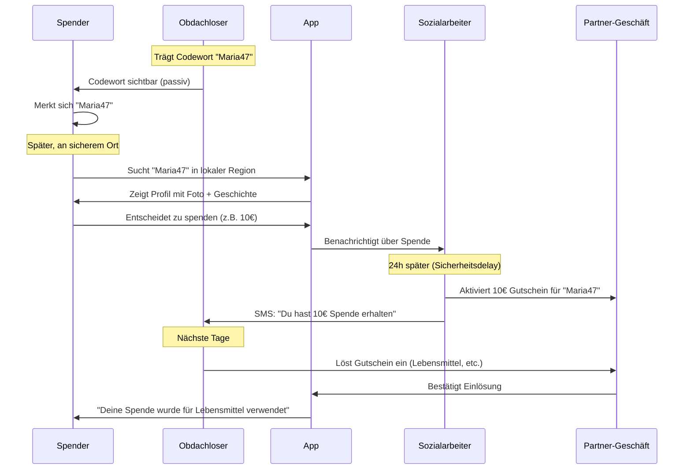
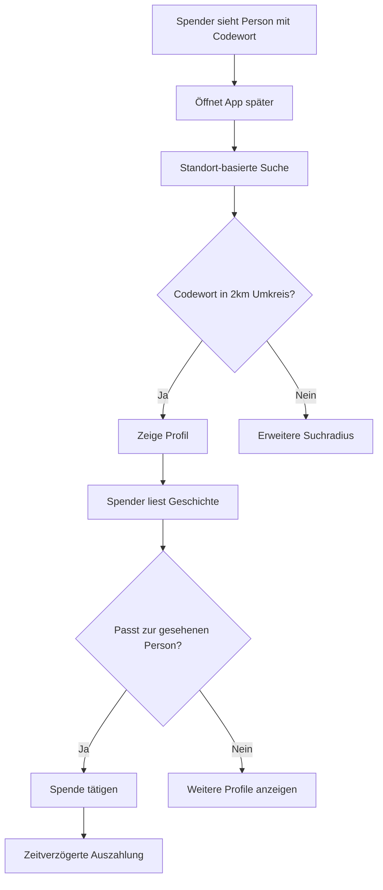
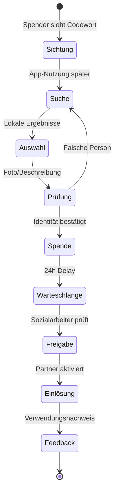

# Digitales Spendensystem für Obdachlose: Codewort-basiertes Interaktionskonzept

## 1. Systemüberblick

Das **CodeHeart-System** ermöglicht würdevolle, sichere und anonyme Spenden an obdachlose Personen durch ein einfaches Codewort-System. Spender sehen ein gut sichtbares Codewort oder einen Namen, suchen diesen in der App und spenden offline - ohne direkte Interaktion oder Sicherheitsrisiken.

## 2. Kernprinzipien

### Würde durch Distanz

- Keine physische Nähe oder direkte Interaktion erforderlich
- Spender können in Ruhe entscheiden, ohne sozialen Druck
- Empfänger werden nicht durch Ablehnung oder negative Reaktionen verletzt

### Sicherheit durch Anonymität

- Kein sichtbarer Wertgegenstand (Smartphone, Karte)
- Zeitverzögerte Auszahlung verhindert Raub-Anreize
- Codewort ist unauffällig und kann wie ein Spitzname aussehen

### Einfachheit in der Nutzung

- Nur ein Wort oder Name muss gemerkt werden
- Lokale Suche beschränkt Ergebnisse
- Intuitive App-Bedienung

## 3. Akteure und ihre Rollen

### Primäre Akteure

**Spender (Geber)**

- Privatpersonen, Touristen, Geschäftsleute
- Sehen Codewort, verwenden App später
- Entscheiden anhand Geschichte und Foto
- Erhalten Verwendungsnachweise

**Obdachlose Personen (Empfänger)**

- Tragen gut sichtbares Codewort (Schild, T-Shirt, Aufkleber)
- Haben optional Smartphone für Benachrichtigungen
- Lösen Spenden bei Partnerorganisationen ein
- Behalten Kontrolle über ihre Geschichte

**Sozialarbeiter/Betreuer (Vermittler)**

- Registrieren und verifizieren Empfänger
- Erstellen und verwalten Codeworte
- Moderieren Geschichten und Fotos
- Koordinieren Auszahlungen

### Sekundäre Akteure

**Hilfsorganisationen**

- Stellen Infrastruktur und Vertrauen bereit
- Verwalten Partnergeschäfte und Auszahlungspunkte
- Bieten zusätzliche Unterstützungsdienste

**Partnergeschäfte/Auszahlungsstellen**

- Supermärkte, Apotheken, Sozialläden
- Ermöglichen Einlösung für Grundbedürfnisse
- Validieren Identität bei Auszahlung

**Städtische Verwaltung**

- Unterstützt Integration in bestehende Sozialsysteme
- Stellt gegebenenfalls Co-Finanzierung bereit

## 4. Das Codewort-System im Detail

### Codewort-Eigenschaften

- **Eindeutig** pro Stadt/Region (max. 50km Radius)
- **Einprägsam**: Vornamen, einfache Begriffe, Spitznamen
- **Unauffällig**: Sieht aus wie normaler Name oder Spitzname
- **Kulturell neutral**: Vermeidet Stereotypen oder Stigmatisierung

### Beispiel-Codeworte

- "Maria47" (Vorname + Geburtsjahr)
- "Hopeful" (positives englisches Wort)
- "Bruno-HH" (Name + Stadtkürzel)
- "Courage15" (Eigenschaft + Lieblingszahl)

### Darstellung

- Handgeschriebenes Schild
- T-Shirt oder Jacke mit Aufdruck
- Wasserfester Aufkleber
- Temporäre Tätowierung
- **Wichtig**: Sieht NICHT wie Werbung oder Bettelschild aus

## 5. Interaktionsmodelle

### Modell 1: Minimale Interaktion (Empfohlen)

### Modell 2: Standort-basierte Suche

### Modell 3: Mehrstufige Verifikation

## 6. User Stories - Erweitert

### Spender-Journey

**Als Pendler möchte ich...**

- Auf dem Weg zur Arbeit ein Codewort sehen und merken
- Abends in Ruhe die Geschichte lesen
- Entscheiden, ob die Person zu dem passt, was ich gesehen habe
- Eine kleine Spende machen, ohne sozialen Druck

**Als Tourist möchte ich...**

- Ohne Sprachbarrieren helfen können
- Sicher sein, dass meine Spende ankommt
- Nicht in unangenehme Situationen geraten
- Auch Tage später noch spenden können

**Als Geschäftsperson möchte ich...**

- Diskret spenden, ohne aufzufallen
- Corporate Giving für mein Unternehmen dokumentieren
- Wirkung meiner Spenden nachverfolgen

### Empfänger-Journey

**Als obdachlose Person möchte ich...**

- Mein Codewort stolz tragen, ohne mich zu schämen
- Nicht ständig Menschen ansprechen müssen
- Kontrolle über meine Geschichte behalten
- Spenden für das verwenden, was ich wirklich brauche
- Wissen, wann jemand an mich gedacht hat

**Als Person mit Smartphone möchte ich...**

- Benachrichtigungen über Spenden erhalten
- Sehen, wie viel verfügbar ist
- Dankesnachrichten senden können (optional)

**Als Person ohne Smartphone möchte ich...**

- Trotzdem vom System profitieren
- Über Sozialarbeiter informiert werden
- Einfach einlösen können

### Sozialarbeiter-Journey

**Als Betreuer möchte ich...**

- Passende Codeworte für meine Klienten erstellen
- Geschichten respektvoll und würdevoll formulieren
- Spendenmissbrauch verhindern
- Fortschritte bei der Reintegration fördern
- Transparenz für Spender gewährleisten

## 7. Sicherheits- und Würde-Konzept

### Physische Sicherheit

- **Keine wertvollen Gegenstände**: Nur Papier/Stoff mit Codewort
- **Zeitverzögerung**: Diebstahl des Codewortes bringt nichts
- **Unauffälligkeit**: Sieht nicht nach "Spendensystem" aus
- **Mehrfachnutzung**: Codewort kann lange verwendet werden

### Psychologische Sicherheit

- **Keine Ablehnung**: Spender entscheiden privat
- **Keine Belästigung**: Keine direkten Anfragen
- **Würdevolle Darstellung**: Geschichten fokussieren auf Hoffnung
- **Selbstbestimmung**: Empfänger kontrollieren ihre Präsentation

### Systemmissbrauch-Prävention

- **Verifizierung**: Nur durch Sozialarbeiter registrierte Personen
- **Monitoring**: Ungewöhnliche Muster werden erkannt
- **Limits**: Maximale Spenden pro Tag/Woche
- **Partnervalidierung**: Einlösung nur bei vertrauenswürdigen Stellen

## 8. Interaktions-Szenarien

### Szenario A: Erfolgreiche Spende

1. **9:00 Uhr**: Maria sitzt vor Supermarkt, Schild "Maria47"
2. **9:15 Uhr**: Thomas sieht sie, merkt sich Codewort
3. **19:30 Uhr**: Thomas sucht "Maria47" in App (zuhause)
4. **19:32 Uhr**: Sieht Foto + Geschichte, erkennt Maria wieder
5. **19:35 Uhr**: Spendet 15€ für "Warme Mahlzeit"
6. **20:00 Uhr**: Sozialarbeiterin Anna wird benachrichtigt
7. **9:00 Uhr +1 Tag**: Anna aktiviert 15€ Gutschein im Supermarkt
8. **9:05 Uhr +1 Tag**: Maria erhält SMS "15€ Spende erhalten"
9. **11:00 Uhr +1 Tag**: Maria kauft warme Suppe im Supermarkt
10. **11:30 Uhr +1 Tag**: Thomas erhält Feedback "Für warme Mahlzeit verwendet"

### Szenario B: Fehlerhafte Identifikation

1. **14:00 Uhr**: Sarah sieht Person mit "Bruno-HH"
2. **20:00 Uhr**: Sarah sucht in App, findet andere Person
3. **20:02 Uhr**: Foto passt nicht zu gesehener Person
4. **20:03 Uhr**: Sarah sucht nach anderen "Bruno" in der Nähe
5. **20:05 Uhr**: Findet richtige Person, spendet erfolgreich

### Szenario C: Missbrauchsversuch

1. **10:00 Uhr**: Krimineller erstellt falsches "Klaus99" Schild
2. **15:00 Uhr**: Spender spendet an "Klaus99"
3. **15:30 Uhr**: System erkennt: "Klaus99" nicht registriert
4. **15:31 Uhr**: Sozialarbeiter wird alarmiert
5. **16:00 Uhr**: Spende wird zurückerstattet, Spender informiert

## 9. Erfolgsmessungen

### Quantitative KPIs

- **Anzahl aktiver Codeworte** pro Stadt
- **Spenden-Konversionsrate** (Sichtung → Spende)
- **Durchschnittliche Spendenhöhe** und -häufigkeit
- **Zeit zwischen Sichtung und Spende**
- **Einlösungsrate** der Gutscheine
- **Wiederholungsrate** von Spendern

### Qualitative KPIs

- **Sicherheitsvorfälle**: Null Diebstähle/Übergriffe
- **Würde-Bewertung**: Empfänger-Zufriedenheit >85%
- **Spender-Erfahrung**: Einfachheit >90%
- **Sozialarbeiter-Akzeptanz**: Arbeitserleichterung
- **Partnergeschäfte-Feedback**: Problemlose Abwicklung

## 10. Systemgrenzen und Abgrenzungen

### Was das System NICHT ist

- Kein Ersatz für professionelle Sozialarbeit
- Keine Vollversorgung für Obdachlose
- Kein Tracking oder Überwachungssystem
- Keine Plattform für kommerzielle Werbung

### Was das System IST

- Ergänzung zu bestehenden Hilfssystemen
- Brücke zwischen Bürgern und Bedürftigen
- Würdevolles Spendentool
- Transparente Mittelverwendung

## 11. Skalierbarkeit und Adaptation

### Lokale Anpassung

- **Sprache**: Codeworte in lokaler Sprache/Dialekt
- **Kultur**: Berücksichtigung kultureller Sensibilitäten
- **Partner**: Integration lokaler Geschäfte und Organisationen
- **Regularien**: Anpassung an lokale Gesetze

### Internationale Erweiterung

- **Währungsadaptation**: Lokale Währungen und Zahlungsmethoden
- **Rechtssysteme**: DSGVO, lokale Datenschutzgesetze
- **Sozialstrukturen**: Anpassung an lokale Hilfssysteme
- **Technologie**: Berücksichtigung lokaler Tech-Infrastruktur

## 12. Risikomanagement

### Hohes Risiko: Systemmanipulation

- **Gegenmaßnahme**: Strenge Registrierung über Sozialpartner
- **Monitoring**: KI-basierte Anomalieerkennung
- **Response**: Schnelle Deaktivierung verdächtiger Codes

### Mittleres Risiko: Datenschutzverletzung

- **Gegenmaßnahme**: Privacy-by-Design, minimale Daten
- **Verschlüsselung**: End-to-End für alle sensiblen Daten
- **Audit**: Regelmäßige Sicherheitsüberprüfungen

### Geringes Risiko: Technischer Ausfall

- **Gegenmaßnahme**: Redundante Systeme, Offline-Backup
- **Fallback**: Manuelle Prozesse über Sozialpartner
- **Recovery**: Automatische Systemwiederherstellung

## 13. Implementierungsroadmap

### Phase 1: Konzept-Validierung (3 Monate)

- Prototyp-App mit Basic-Funktionen
- Pilottest mit 10 Empfängern und 50 Spendern
- Feedback-Integration und Systemanpassung

### Phase 2: Lokaler Rollout (6 Monate)

- Launch in einer deutschen Großstadt
- 100+ registrierte Empfänger
- Partnerschaft mit 10+ Geschäften/Organisationen
- Marketing und Awareness-Kampagne

### Phase 3: Regionale Expansion (12 Monate)

- Ausweitung auf 5 deutsche Städte
- 1000+ aktive Nutzer (Spender + Empfänger)
- Automatisierung der Prozesse
- Corporate Partnership Program

### Phase 4: Nationale Skalierung (24 Monate)

- Deutschland-weite Verfügbarkeit
- Integration mit staatlichen Sozialsystemen
- Franchise-Modell für andere EU-Länder
- Langfristige Nachhaltigkeit sicherstellen
